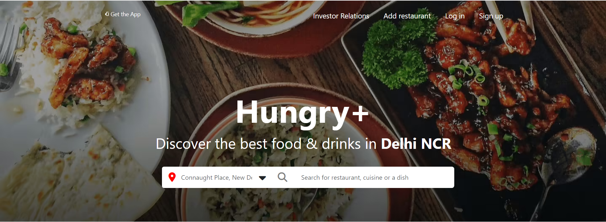
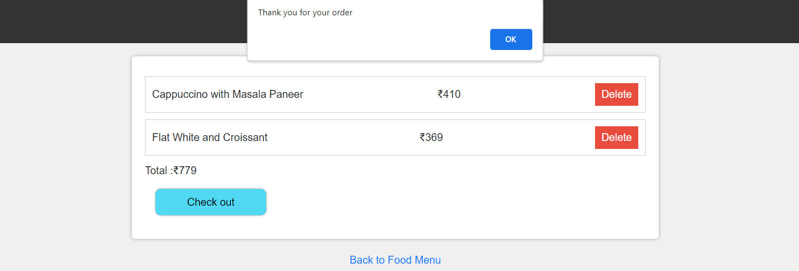
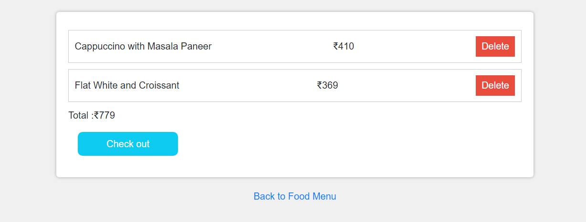
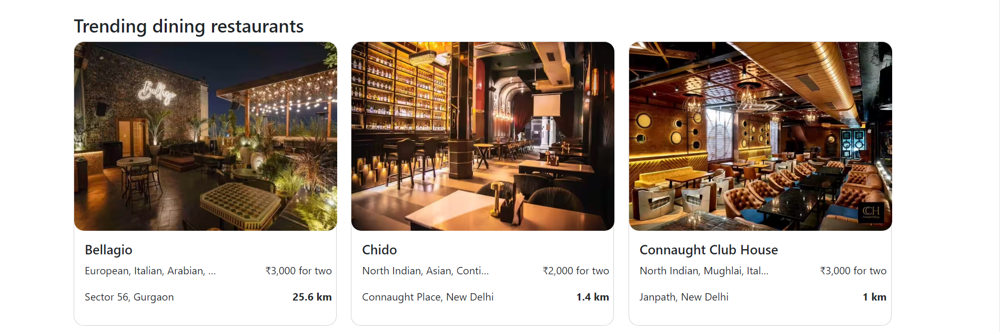
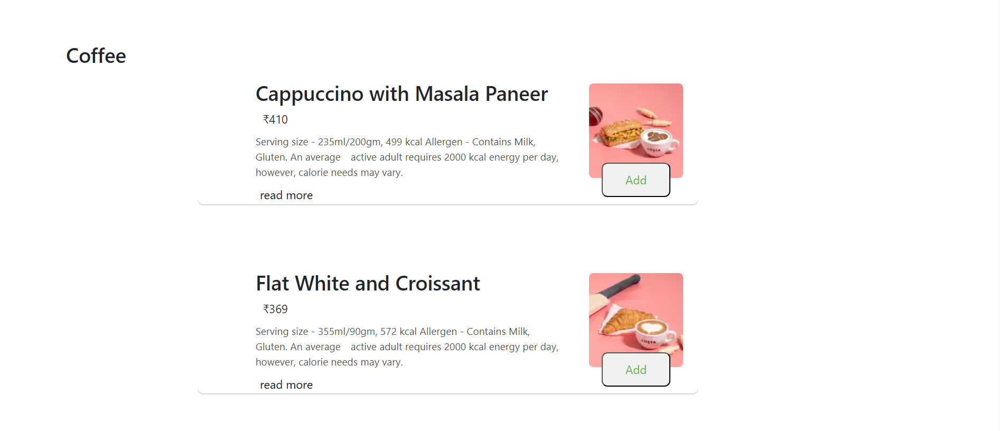
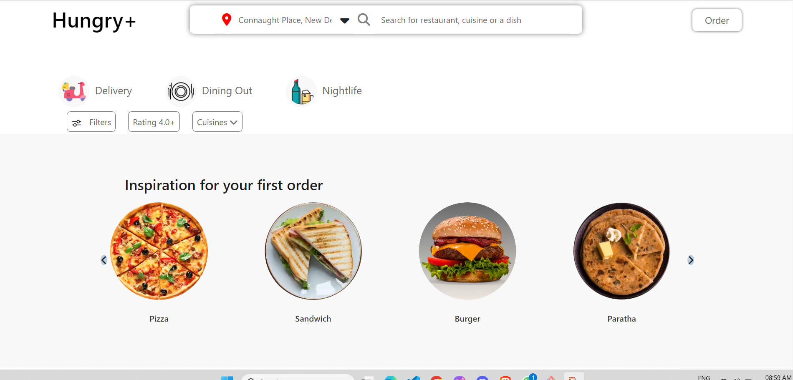
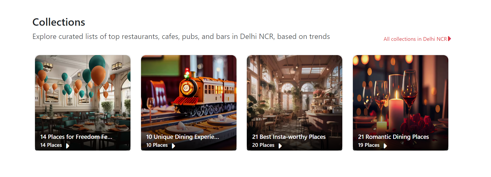
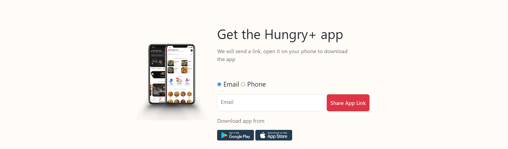
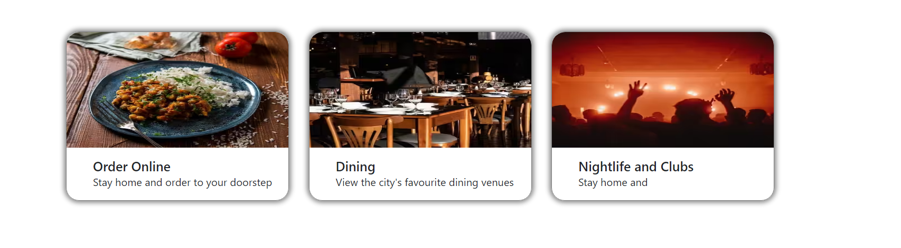

# HungryPulse

HungryPulse is a web application built using HTML, CSS, and JavaScript. It serves as a clone of Zomato, allowing users to search for restaurants, view their menus, and place orders for food delivery.

# Demo
https://hungrypulse.netlify.app/
# ScreenShots

